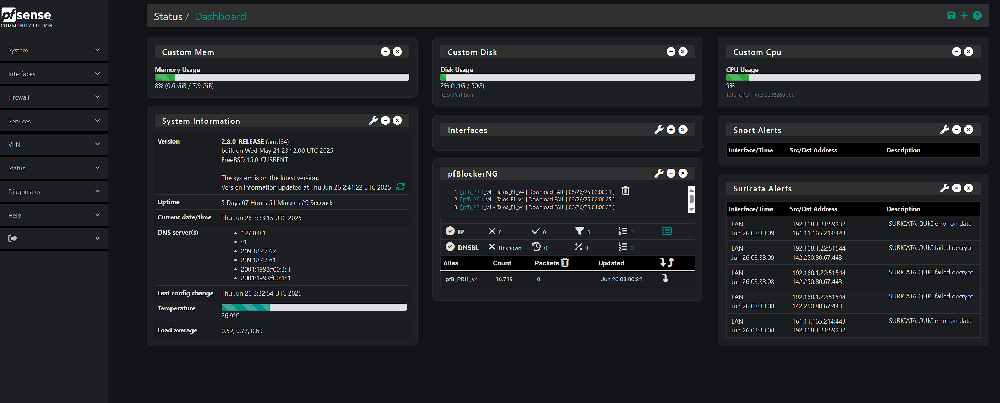

# pfSense Modern GUI

🎨 A sleek, fully redesigned front-end for pfSense — optimized for 2025 and beyond.

## 🚀 Features

- Floating widgets with modern shadows and transitions
- Collapsible sidebar navigation
- Dark mode with accent highlights
- Responsive UI for desktops and tablets
- Font Awesome integration

## 📸 Preview



## 📦 Installation

1. Clone or download this repo.
2. Copy `pfsense-modern.css` to your pfSense box at `/usr/local/www/css/`.
3. Apply it via `Diagnostics > Command Prompt`:
   ```sh
   cp /usr/local/www/css/pfsense-modern.css /usr/local/www/css/pfSense.css
